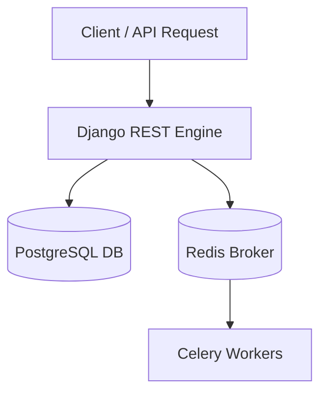

<-- TelMart -->
<div align="center">

# 🛒 TelMart Backend System

<p>
  <b>An asynchronous e-commerce for mobile on Sudan backend architecture powered by Django, Celery, and Docker.</b>
  <br />
  نظام خلفي متكامل للتجارة الإلكترونية في الموبايلات داخل السودان معالَج لا تزامنياً باستخدام دجانجو، سيليري، ودعامات دوكر.
</p>

<!-- Tech Badges -->
<p>
  
  
  
  
  
</p>

<p>
  <a href="#-about-the-project"><b>English Section</b></a> •
  <a href="#-عن-المشروع"><b>القسم العربي</b></a>
</p>

</div>

---

## 🚀 About The Project
**TelMart** is a robust backend engine designed to handle heavy background tasks, scheduled operations, and API-driven e-commerce mobile on Sudan workflows cleanly and efficiently.

### Key Highlights
- **Asynchronous Task Processing:** Heavy operations offloaded to background workers using Celery & Redis.
- **Containerized Architecture:** Fully dockerized development and deployment environment.
- **RESTful Endpoints:** Structured and clean API design.

### System Architecture


---

## 🛠️ Quick Start

Ensure you have **Docker** and **Docker Compose** installed.

1. **Clone Repository:**
   ```bash
   git clone [https://github.com/bdalatykhald08-glitch/Telmart.git](https://github.com/bdalatykhald08-glitch/Telmart.git)
   cd Telmart
   ```

2. **Run with Docker Compose:**
   ```bash
   docker-compose up --build
   ```

3. **Access API:**
   The server will be live at `http://localhost:8000/`.

---
---

<!-- القسم العربي -->
<div dir="rtl">

## 🛒 عن المشروع
**TelMart** هو محرك باك إند متكامل مخصص لإدارة معالجة العمليات المجدولة والمهام الخلفية غير التزامنية لخدمة بيع وشراء موبايل بأمان في السودان بكفاءة عالية.

### أبرز الميزات
- **معالجة المهام الخلفية:** اعتماد Celery مع Redis كوسيط للرسائل لإجراء المهام الثقيلة خلف الكواليس.
- **بيئة حاويات متكاملة:** تجهيز المشروع بالكامل عبر Docker & Docker Compose لتسهيل التشغيل والرفع.
- **هيكلية نظيفة:** تصميم منظم للواجهات البرمجية (REST APIs) وقواعد البيانات.

---

## 🛠️ تشغيل المشروع سريعاً

تأكد من تثبيت **Docker** و **Docker Compose** على جهازك.

1. **نسخ المستودع:**
   ```bash
   git clone [https://github.com/bdalatykhald08-glitch/Telmart.git](https://github.com/bdalatykhald08-glitch/Telmart.git)
   cd Telmart
   ```

2. **البناء والتشغيل بـ Docker:**
   ```bash
   docker-compose up --build
   ```

3. **الوصول للخدمة:**
   سيعمل الخادم تلقائياً على الرابط `http://localhost:8000/`.

---

## 📜 الترخيص (License)
تخضع هذه اللائحة لرخصة [MIT License](LICENSE).

</div>
